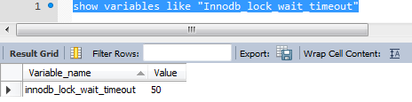

# 你在项目中遇到了哪些问题？是如何解决的？

### 1.项目上线后日志出现 lock wait timeout exceeded

- **问题描述**：

  四个项目A,B,C,D需要共同操作一张表，其中A项目在17点之后启动，B项目在15-17点一直发送邮件，C、D项目15-17点一直报错，错误如下图：

```verilog
Caused by: com.mysql.cj.jdbc.exceptions.MySQLTransactionRollbackException: Lock wait timeout exceeded; try restarting transaction
```

- **分析**：

  这个报错是mysql锁等待时间过长，一个项目占用表时间过长，其他项目用到时需要等待

- **解决方案一** ：

  将数据库mysql锁等待时间设置的大一些

  mysql8.0数据库默认锁等待是50s：

```sql
show variables like "Innodb_lock_wait_timeout"
```



由下图可见，B项目每10分钟执行一次，执行一次的时间约为51秒，在第51秒时发送完一封邮件并打印了日志

.jpg)

所以我们可以将这个等待时间扩大到2分钟，但是，可能会造成等待的线程过多，项目响应过慢等问题

- 解决方案二：

  B项目由于启用了事务，且select 、update的 where时 未使用主键（非空且唯一索引），造成对该表整体上锁，如果只对其操作的行上锁，则不影响其他项目对其他行的操作
  
- 烂尾


### 2.数据量大，分页时总数据的顺序出现变化

- **问题描述**

  由于表中数据量大，无法全部查出来放入java对象中（堆溢出），所以使用分页的方式，一部分一部分的取数据。oracle经典分页sql如下（错误）：

  ```sql
  SELECT * FROM (
      SELECT ROWNUM AS rowno,t.* 
      FROM table_name t
      WHERE
        t.a = XXX
      AND ROWNUM < 11800 
      ORDER BY 主键id 
  ) table_alias
  WHERE
    table_alias.rowno >11749
  ```

  由于发现每次查出来的数据顺序不一样，所以便以主键id排序

- **分析**

  1. 可能是因为where导致每次查出来的数据顺序不一致
  2. order by的优先级低于where，所以是先查询后排序，应该是先排序后查询

- **解决方案**

  使用先排序后查询，也就是将上面的table_name表变为排序后的数据

  oracle经典分页sql如下（正确）：

  ```sql
  SELECT * FROM (
      SELECT ROWNUM AS rowno,t.* 
      FROM (
          select * from table_name where a = XXX order by 主键id 
      ) t
      WHERE
   	  ROWNUM < 11800 
  ) table_alias
  WHERE
    table_alias.rowno >11749
  ```

  

- **扩展**

  - MySql 关键字的执行优先级

    from  

    on  

    join  

    where  

    group by  

    having  

    select  

    distinct  

    union  

    order by 

  - 为什么sql查询结果顺序不一致


```reStructuredText
	根数据库系统的算法有关,早期版本的算法是自然的多个线程二分法,那个线程先查到满足条件的数据就先输出出来,这样就是乱序的,后期经过改进按照主键自然排序输出。如果order by的值相同，一般是按自然排序，就是首个字符的字母或汉字的发音的首字母的s排序。
	order by的字段自然排序,如果你的order by 字段是resort,resort值相同的情况下，是可能有两种结果，一种就是你列出的随机排序，还有一种就是按主键来排序。这个问题不是固定的，还可能跟你的服务器性能都有关系，如果内存足够大，执行mysql的时候会提供足够大的缓冲池，也可能会出现另一种结果。
```

  - oracle分页新方式（Oracle 12c以上版本，*Oracle 11g*及以下版本不能用）

    [链接]: https://www.yiibai.com/oracle/oracle-fetch.html

    fetch子句语法：

    ```sql
    [ OFFSET offset ROWS]
     FETCH  NEXT [  row_count | percent PERCENT  ] ROWS  [ ONLY | WITH TIES ]
    ```

    例子：取第11行~第20行数据

    ```sql
    SELECT
     product_name,
     quantity
    FROM
     inventories
    INNER JOIN products
     USING(product_id)
    ORDER BY
     quantity DESC 
    OFFSET 10 ROWS 
    FETCH NEXT 10 ROWS ONLY;
    ```

    WITH TIES说明：必须用在order by语句中，如果最后一个数据存在并列的情况，则可以查出并列的数据。

    例：排序取第一，如果并列第一，则取到所有并列第一的数据