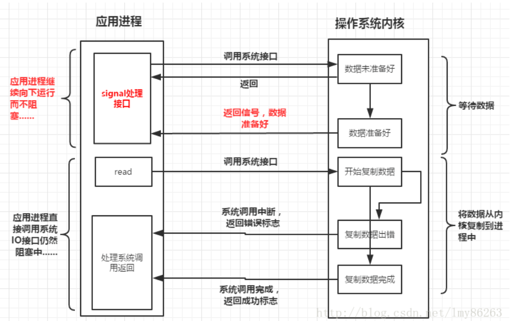

## IO

#### 1.Unix中的IO模型

[Unix中的IO模型：帮你弄清阻塞VS非阻塞、同步VS异步](https://blog.csdn.net/lmy86263/article/details/55681371)

##### 1.1 数据从磁盘加载到进程的过程

经过两个阶段：

1. 数据加载到内核
2. 从内核复制数据到进程

注意：进程通信不都需要经过系统内核，比如共享内存

##### 1.2 阻塞IO模型

第一阶段（将数据从磁盘加载到内核中）时，应用进程阻塞。

第二阶段（将数据从内核复制到进程中）时，应用进程阻塞。

##### 1.3 非阻塞IO模型

第一阶段（将数据从磁盘加载到内核中）时，应用进程轮询时阻塞。

第二阶段（将数据从内核复制到进程中）时，应用进程阻塞。

相比于阻塞IO模型，非阻塞IO模型可以使应用进程在轮询间隔期间处理其他事情

##### 1.4 IO复用模型

第一阶段（将数据从磁盘加载到内核中）时，应用进程不被阻塞，应用进程的处理内核响应的子线程阻塞。

第二阶段（将数据从内核复制到进程中）时，应用进程阻塞。

相比于非阻塞IO模型，IO复用模型可以同时处理多个IO

##### 1.5 信号驱动IO模型

第一阶段（将数据从磁盘加载到内核中）时，应用进程不被阻塞，应用进程的处理内核响应的子线程不被阻塞。

第二阶段（将数据从内核复制到进程中）时，应用进程阻塞。

##### 1.6 异步IO模型

第一阶段（将数据从磁盘加载到内核中）时，应用进程不被阻塞。

第二阶段（将数据从内核复制到进程中）时，应用进程不被阻塞。

##### 1.7 五种模型的对比

异步和多线程的区别：

异步和多线程并不是相同的概念，虽然我们在平时经常将两者混用，其实它们不是一个层次上的概念，异步具体的说是要达到的目的，而多线程只是实现这个目的的一个手段，还有其他的手段，比如多进程，但是由于常用的实现异步的方式就是多线程，所以常常将两者混淆，因此针对多线程的编程准确的来说应该是并发编程而不是异步编程。所以在上面提到的多线程结合阻塞IO模型，虽然使用了多线程，但是从本质上来说，每个线程对应的仍是阻塞IO模型，所以它也是同步模型，只不过是从主线程来看达到了异步的效果。

[文件传输中的零拷贝](https://mp.weixin.qq.com/s/-AnVV8IYYedVSGBK95L_bw)

