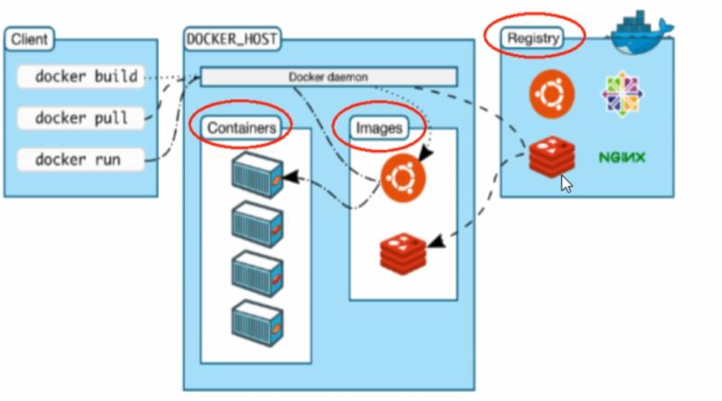

### Docker

<https://www.bilibili.com/video/BV1Vs411E7AR>

#### 1.简介

##### 1.1 理念

Debug your app, not your environment

Securely build and share any application, anywhere

##### 1.2 传统虚拟机的缺点

资源占用多、冗余步骤多、启动慢

##### 1.3 Docker和传统虚拟化技术的区别

- 传统虚拟机技术是虚拟出一套硬件后，在其上运行一个完整的操作系统
- 而容器的应用进程直接运行与宿主的内核，容器内没有自己的内核，也没有硬件虚拟
- 每个容器之间相互隔离，每个容器有自己的文件系统，容器之间进程不会相互影响，能区分计算资源

|            | docker                  | 虚拟机                      |
| ---------- | ----------------------- | --------------------------- |
| 操作系统   | 与宿主机共享OS          | 宿主机OS上运行虚拟机OS      |
| 存储大小   | 镜像小                  | 镜像大                      |
| 运行性能   | 几乎无额外性能损耗      | 操作系统额外的CPU、内存消耗 |
| 移植性     | 轻便、灵活，适用于Linux | 笨重，与虚拟化技术耦合度高  |
| 硬件亲和性 | 面向软件开发            | 面向硬件运维                |
| 部署速度   | 秒级                    | 10S以上                     |


##### 1.4 DevOps

- 更快速的应用交付和部署
- 更便捷的升级和扩缩容
- 更简单的系统运维
- 更高效的计算资源利用

##### 1.5 Docker的组成

- 镜像

  镜像是容器的只读模板，一个镜像可创建多个容器

- 容器

  - 容器是镜像创建的一个运行实例
  - 它可以被启动，运行，暂停，删除。每个容器都是相互隔离的
  - 可以把容器看作一个简易的Linux环境
  - 容器的定义和镜像几乎一模一样，也是一堆层的统一视角，唯一区别是容器最上面的那一层可读可写

- 仓库
  - 是集中存放镜像的场所
  - 仓库和仓库注册服务器是有区别的，仓库注册服务器上放着多个仓库，每个仓库放着多个镜像，每个镜像有不同的标签
  - 仓库分为公有和私有仓库
  - 最大的公开仓库是：https://hub.docker.com
  - 国内公开的仓库有：阿里云、网易云

##### 1.6 Docker基本架构



#### 2.安装

环境：centos7.X

##### 2.1 安装

<https://docs.docker.com/install/linux/docker-ce/centos/>

##### 2.2 配置阿里镜像加速器

<https://cr.console.aliyun.com/cn-hangzhou/instances/mirrors>

##### 2.3 测试阿里镜像

```shell
docker run hello-word
```


#### 3.常用命令

##### 3.1 帮助命令

- docker version
- docker info
- docker --help

##### 3.2 镜像命令

- 查看本机镜像

  命令：docker images

  参数：-a 查看全部镜像

  ​			-q 只查看镜像ID

  ​			--digests 显示摘要信息

  ​			--no-trunc 显示完整镜像信息	

- 从dockerhub上查找镜像

  命令：docker search 镜像名称

  参数：-s N 列出star数大于等于N的镜像

  ​			--no-trunc

  ​			--automated 列出automated build的镜像

- 下载镜像

  命令：docker pull 镜像名称

- 删除镜像

  命令：docker rmi 镜像名称/ID

  参数：-f 强制删除

  删除多个：docker rmi -f 镜像名称/ID 镜像名称/ID

  删除所有：docker rmi -f $(docker images -qa)

##### 3.3 容器命令

- 新建并启动容器

  命令：docker run 镜像名称/ID

  参数：--name="容器别名"

  ​			-d 后台运行容器，并返回容器ID，启动守护式容器

  ​			-i 以交互模式运行容器

  ​			-t 为容器重新分配一个伪输入终端

  ​			-P 随机端口映射 

  ​			-p 指定端口映射，四种格式：（ip:hostPort:containerPort | ip::containerPort | **hostPort:containerPort** | containerPort）

- 列出当期所有正在运行的容器

  命令：docker ps

  参数：-a 列出当期所有正在运行的容器和历史运行过的容器

  ​			-l 显示最近创建的容器

  ​			-n N 显示最近创建的N个容器

  ​			-q 静默模式，只显示容器ID

  ​			-no-trunc 

- 退出容器

  命令：exit 容器停止退出

  ​			Ctrl+P+Q 容器不停止退出

- 启动容器

  命令：docker start 容器名/ID

- 重启容器

  命令：docker restart 容器名/ID

- 停止容器

  命令：docker stop 容器名/ID

- 强制停止容器

  命令：docker kill 容器名/ID

- 删除已停止的容器

  命令：docker rm -f 容器名/ID

  删除所有容器：docker rm -f $(docker ps -qa)

  ​							docker ps -qa | xargs docker rm

- 查看容器日志

  命令：docker logs -f -t --tail 8 容器ID

  参数：-f 跟随最新的日志打印

  ​			-t 加入时间戳

  ​			--tail N 显示最后N条

- 查看容器内的进程

  命令：docker  top 容器ID

- 查看容器内部细节

  命令：docker inspect 容器ID

- 进入正在运行的容器并以命令行交互

  命令：docker attach 容器ID 进入容器终端

  命令：docker exec -it 容器ID ls -l /usr

  ​			docker exec -it 容器ID /bin/bash

  ​			在容器中打开新的终端，并且可以启动新的进程

- 从容器内拷贝文件到主机上

  命令：docker cp 容器ID:容器文件路径 主机文件路径

#### 4.Docker镜像

镜像是一种轻量级、可执行的独立软件包，用来打包软件运行环境和基于运行环境开发的软件，它包含运行某个软件所需的所有内容，包括代码、运行时库、环境变量和配置文件

**UnionFS（联合文件系统）**

是一种分层、轻量级并且高性能的文件系统，它支持对文件系统的修改作为一次提交来一层层的叠加，同时可以将不同目录挂载到同一个虚拟文件系统下。镜像可以通过分层来进行继承，基于基础镜像，可以制作各种具体的应用镜像。

**镜像加载原理**

docker的镜像实际上由一层一层的文件系统组成，这种层级的文件系统（unionFS）。

bootfs主要包含BootLoader和kernel，BootLoader主要引导加载kernel，Linux刚启动时会加载bootfs，在docker镜像的最底层是bootfs。当boot加载完成后整个内核都在内存中了，此时内存的使用权由boots转交给内核，此时系统会卸载bootfs

rootfs在bootfs之上。是各种不同操作系统的发行版，如Ubuntu、centos等

#### 5.Docker commit

提交容器副本使之成为新的镜像

命令：docker commit -m='提交的描述信息' -a='作者' 容器ID 目标镜像名:[标签]

#### 6.Docker容器数据卷

需求：1.需要对容器软件运行产生的数据进行持久化 2.容器间数据共享

**容器数据卷的特点：**

- 数据卷可以在容器之间共享或重用数据
- 卷中更改可以直接生效
- 数据卷中的更改不会包含在镜像的更新
- 数据卷的生命周期一直持续到没有容器使用它为止

##### 6.1 容器添加数据卷

- 使用命令添加

  命令：docker run -it -v 宿主机绝对路径目录:容器内目录 --privileged=true 镜像名

  带权限：docker run -it -v 宿主机绝对路径目录:容器内目录:ro 镜像名

- 使用DockerFile添加

  1. 自定义DockerFile脚本

     ```dockerfile
     # volume test
     FROM centos
     VOLUME ["/dataContainer1", "/dataContainer2"]
     CMD echo "finish0.0"
     CMD /bin/bash
     ```

  2. 使用DockerFile构建镜像

     ```shell
     docker build -f DockerFile脚本路径 -t 自定义镜像名aa .
     ```

  3. 使用镜像，运行容器

     docker run -it 自定义镜像名aa

  4. 该容器对应的本机上的映射地址查看

     docker inspect 容器ID

##### 6.2 数据卷容器

命名的容器挂载数据卷，其它容器通过挂载这个父容器实现数据共享，挂载数据卷的容器，称为数据卷容器

**例子：**

1. 创建并运行一个容器aa

   docker run -it --name aa  my/centos

2. 创建并运行一个容器bb，使bb的容器卷依赖于aa

   docker run -it --name bb --volumes-from aa my/centos

#### 7.DockerFile解析

##### 7.1 保留字指令

- FROM

  当前镜像基于哪个镜像

- MAINTAINER

  镜像维护者名字和邮箱

- RUN

  容器构建时需要运行的命令

- EXPOSE

  当期容器对外暴露的端口号

- WORKDIR

  指定在容器创建后，终端默认登录进来的目录

- ENV

  设置环境变量

- ADD

  将宿主机目录下的文件拷贝进镜像，并自动处理URL和解压tar压缩包

- COPY

  类似ADD，拷贝文件和目录到镜像中

- VOLUME

  容器数据卷，用于数据共享和持久化

- CMD

  指定一个容器启动时要运行的命令

  Dockerfile可以有多个CMD命令，但只有最后一个生效，CMD会被docker run之后的参数替换

  CMD指定的格式和RUN相似，也是两种格式：

  - shell格式：CMD <命令>
  - exec格式：CMD["可以执行文件","参数1","参数2"]
  - 参数列表格式：CMD["参数1","参数2",...]，在指定了ENTRYPOINT指令后，用CMD指定具体的参数

- ENTRYPOINT

  和CMD一样，但是不会被覆盖，可追加参数

- ONBUILD

  当前Dockerfile被继承时，触发ONBUILD

##### 7.2 例子

```dockerfile
FROM centos
MAINTAINER capture<capture@qq.com>
# 把宿主机当前上下文的c.txt拷贝到容器/usr/local路径下，并重命名
COPY c.txt /usr/local/cc.txt
# 把宿主机当前上下文的jdk和Tomcat添加并解压到容器中
ADD jdk-8u171-linux-x64.tar.gz /usr/local
ADD apache-tomcat-9.0.8.tar.gz /usr/local
# 安装vim编辑器
RUN yum -y install vim
# 设置登录落脚点
ENV MYPATH=/usr/local
WOEKDIR $MYPATH
# 配置JDK和Tomcat环境变量
ENV JAVA_HOME /usr/local/jdk-1.8.0_171
ENV CLASSPATH $JAVA_HOME/lib/dt.jar:$JAVA_HOME/lib/tools.jar
ENV CATALINA_HOME /usr/local/apache-tomcat-9.0.8
ENV PATH $PATH:$JAVA_HOME/bin:$CATALINA_HOME/lib:$CATALINA_HOME/bin
# 容器运行时监听的端口
EXPOSE 8080
# 启动时运行Tomcat
CMD /usr/local/apache-tomcat-9.0.8/bin/startup.sh && tail -F /usr/local/apache-tomcat-9.0.8/bin/logs/catalina.out
```

#### 8.Docker常用安装

##### 8.1 安装MySQL

```shell
docker run -p 3306:3306 --name mysql5.6 \
-v /mysql/conf:/etc/mysql/conf.d \
-v /mysql/logs:/logs \
-v /mysql/data:/var/lib/mysql \
-e MYSQL_ROOT_PASSWORD=123456
-d mysql:5.6
```

##### 8.2 安装Redis

```shell
docker run -p 6379:6379 \
-v /myredis/data:/data \
-v /myredis/conf/redis.conf:/usr/local/etc/redis/redis.conf \
-d redis:3.2 \
redis-server /usr/local/etc/redis/redis.conf --appendonly yes
```


#### 9.本地镜像发布到阿里云

#### 

