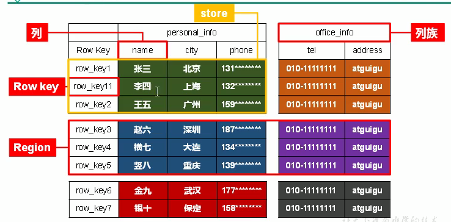
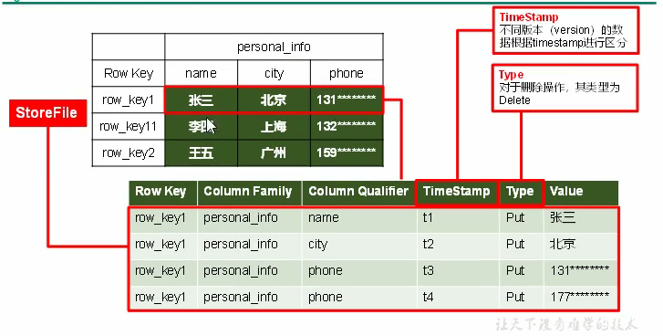
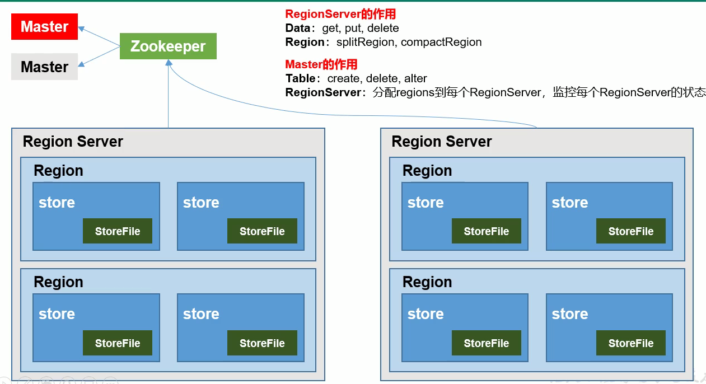
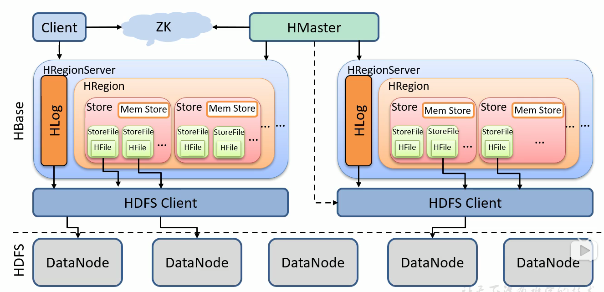
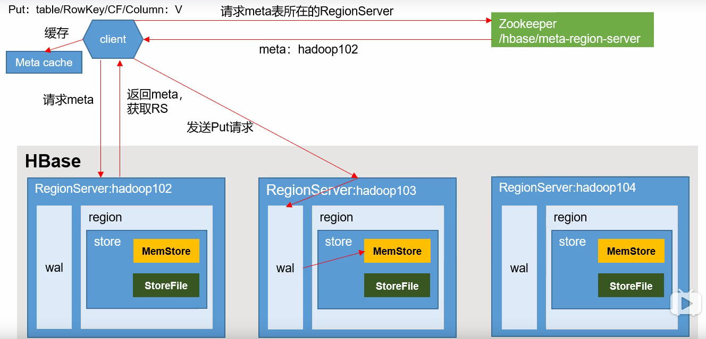
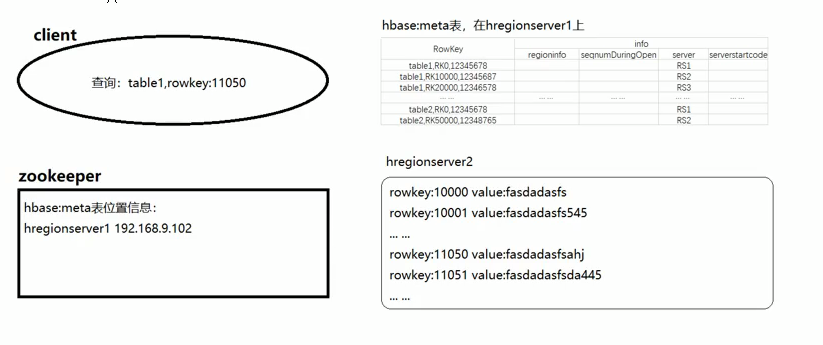
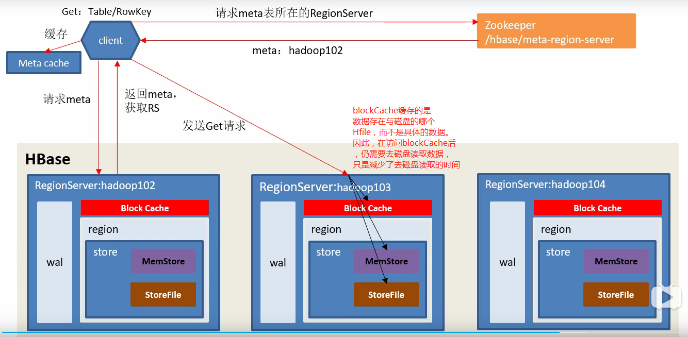

### HBase

#### 1.简介

##### 1.1 定义

> HBase 是一种分布式、可扩展、支持海量数据存储的NoSQL数据库

##### 1.2 数据模型

[数据模型](http://hbase.apache.org/book.html#datamodel)

- name space
- region
- row
- column
- timestamp
- cell

##### 1.3 逻辑结构



##### 1.4 物理结构



##### 1.5 基础架构


>>>>>>> new

- Master挂掉时，不会影响数据的读写
- Master长期挂掉时，Region的split只能放在同一个RegionServer上

#### 2.集群安装

- 解压包

- 修改配置文件

  ```properties
  hbase.zookeeper.quorum = node01,node02,node03
  ```

- 启动Master和RegionServer

#### 3.命令行操作

- 基本操作：list、help

- DDL：alter、alter_async、alter_status、create、describe、disable、disable_all、drop、drop_all、enable、enable_all、exists、get_table、is_disable、is_enabled、list、locate_region、show_filters

  ```powershell
  # 创建命名空间
  create_namespace 'bigdata'
  # 创建表以及列簇
  create 'bigdata:student','info1','info2'
  # 查询表信息
  describe 'bigdata:student'
  # 修改表版本
  alter 'bigdata:student',{NAME=>'info',VERSION=>'3'}
  # 删除表
  disable 'bigdata:student'
  drop 'bigdata:student'
  ```

- DML：append、count、delete、deleteall、get、get_counter、get_splits、incr、put、scan、truncate、truncate_preserve

  ```powershell
  # 新增一条信息
  put 'bigdata:student','00001','info1:name','zhangsan'
  # 查询信息
  scan 'bigdata:student'
  scan 'bigdata:student',{ROW=>TRUE,VERSIONS=>10}
  get 'bigdata:student','00001'
  get 'bigdata:student','00001','info1'
  get 'bigdata:student','00001','info1:name'
  scan 'bigdata:student',{STARTROW=>'00001',STOPROW=>'00005'}
  ```

#### 4.详细架构



- client做DML操作可以直接向HRegionServer请求
- client做DDL操作需要去HMaster

##### 4.1 写流程



先放入wal内存，再放入MemStore内存，最后同步（持久化）wal，如果同步wal失败，则回滚，MemStore中的数据删掉

meta表信息：



##### 4.2 MemStore Flush

Flush时，MemStore中的同一数据（不同版本），会删除老版本，Hfile中保存最新数据

- hbase.regionserver.global.memstore.size（默认是堆内存的40%）

  设置RegionServer最大存储量，达到时开始Flush

- hbase.regionserver.global.memstore.size.lower.limit（默认是95%）

  达到限定RegionServer最大存储量的95%时开始Flush，如果达到100%时，会停止读写，只进行Flush

- hbase.regionserver.optionalcacheflushinterval（默认是3600000毫秒）

  如果距离最后一次Flush到达一个小时，则进行Flush

- hbase.hregion.memstore.flush.size（默认是128M）

  设置单个Region最大存储量

##### 4.3 读流程



##### 4.4 StoreFile Compaction

由于每次Flush，都会产生一个HFile，所以需要定期的合并，分为Minor Compaction和Major Compaction。Minor Compaction不会删除数据，而Major Compaction会删除数据

- hbase.hregion.majorcompaction（默认604800000毫秒）

  建议设置为0，空闲时手动触发，防止白天合并

- hbase.hstore.compactionThreshold（默认是3，此时合并为Major Compaction）

  在store中hfile的数量为3个的时候合并hfile，由于集群中为了保持数据一致性，合并的文件并不会立即删除

##### 4.5 Region Split

- hbase.hregion.max.filesize（默认10）

- 1个region中的某个Store下所有的StoreFile的总大小超过Min(R^2 * "hbase.hregion.memstore.flush.size(默认为一个block的大小：128M)"，hbase.hregion.max.filesize)时，会进行切分，其中R为RegionServer中Table的数量
- 这样切分会产生**数据倾斜**的问题，使用预分区解决
- 为什么官方不建议使用多个列簇？因为当某个列簇数据量大时，会触发Major Compaction，而数据量小的列簇会产生小文件

#### 5.API使用

##### 5.1 基本操作

- maven依赖

  ```xml
  <dependency>
      <groupId>org.apache.hbase</groupId>
      <artifactId>hbase-server</artifactId>
      <version>1.3.1</version>
  </dependency>
  
  <dependency>
      <groupId>org.apache.hbase</groupId>
      <artifactId>hbase-client</artifactId>
      <version>1.3.1</version>
  </dependency>
  ```

- 创建连接和客户端对象

  ```java
  private static Connection connection = null;
  private static Admin admin = null;
  
  static {
      try {
          Configuration configuration = new Configuration();
          configuration.set("hbase.zookeeper.quorum","node01,node02,node03");
          connection = ConnectionFactory.createConnection(configuration);
          admin = connection.getAdmin();
      }catch (Exception e){
          e.printStackTrace();
      }
  }
  ```

- DDL操作

  创建表

  ```java
  public static void createTable(String tableName, String ...columnFamilyNames){
      if (columnFamilyNames.length < 1){
          System.out.println("列簇不能为空");
          return;
      }
      if (admin.tableExists(TableName.valueOf("student")){
          System.out.println("表已存在");
          return;
      }
  
      // 创建表描述符
      HTableDescriptor tabDesc = new HTableDescriptor(TableName.valueOf(tableName));
      // 向表描述符中添加列描述符
      for (String columnFamilyName : columnFamilyNames) {
          HColumnDescriptor hColDesc = new HColumnDescriptor(columnFamilyName);
          hTableDescriptor.addFamily(hColumnDescriptor);
      }
      // 创建表
      admin.createTable(hTableDescriptor);
  }
  ```

  删除表

  ```java
  public static void dropTable(String tableName) throws IOException {
      if (admin.tableExists(TableName.valueOf(tableName))){
          System.out.println("表已存在");
      }
      // 使表下线
      admin.disableTable(TableName.valueOf(tableName));
      // 删除表
      admin.deleteTable(TableName.valueOf(tableName));
  }
  ```

- DDL操作

  插入数据

  ```java
  public static void put(String tableName, String rowKey, 
                         String colFamName, String colName, 
                         String value) throws IOException {
  	// 创建表连接
      Table table = connection.getTable(TableName.valueOf(tableName));
  	// 创建put对象
      Put put = new Put(Bytes.toBytes(rowKey));
      put.addColumn(Bytes.toBytes(colFamName),
                    Bytes.toBytes(colName),
                    Bytes.toBytes(value));
      // 插入数据
      table.put(put);
      // 关闭连接
      table.close();
  }
  ```

  删除数据

  ```java
  
  ```

##### 5.2 与MR交互

- 在Hadoop(MR)中配置HBase的信息

- MR向HBase写数据

  Mapper: 

  ```java
  import org.apache.hadoop.io.LongWritable;
  import org.apache.hadoop.io.Text;
  import org.apache.hadoop.mapreduce.Mapper;
  import java.io.IOException;
  
  public class FruitMapper extends Mapper<LongWritable, Text, LongWritable, Text> {
  
      @Override
      protected void map(LongWritable key, Text value, Context context) 
          throws IOException, InterruptedException {
          context.write(key, value);
      }
  }
  ```

  Reducer:

  ```java
  import org.apache.hadoop.hbase.client.Put;
  import org.apache.hadoop.hbase.mapreduce.TableReducer;
  import org.apache.hadoop.hbase.util.Bytes;
  import org.apache.hadoop.io.LongWritable;
  import org.apache.hadoop.io.NullWritable;
  import org.apache.hadoop.io.Text;
  import java.io.IOException;
  
  public class FruitReducer extends TableReducer<LongWritable, Text, NullWritable> {
  
      @Override
      protected void reduce(LongWritable key, Iterable<Text> values, 
                            Context context) throws IOException, InterruptedException {
          // 1.遍历values
          for (Text value : values) {
              // 2.获取每一行数据，并分割
              String[] split = value.toString().split("/t");
              // 3.构建put对象
              Put put = new Put(Bytes.toBytes(split[0]));
              // 4.给put对象赋值
              put.addColumn(Bytes.toBytes("info"),Bytes.toBytes("name"),
                            Bytes.toBytes(split[1]));
              put.addColumn(Bytes.toBytes("info"),Bytes.toBytes("color"),
                            Bytes.toBytes(split[2]));
              // 5.将put对象写出
              context.write(NullWritable.get(),put);
          }
      }
  }
  ```

  Driver:

  ```java
  import org.apache.hadoop.conf.Configuration;
  import org.apache.hadoop.fs.Path;
  import org.apache.hadoop.hbase.mapreduce.TableMapReduceUtil;
  import org.apache.hadoop.io.LongWritable;
  import org.apache.hadoop.io.Text;
  import org.apache.hadoop.mapreduce.Job;
  import org.apache.hadoop.mapreduce.lib.input.FileInputFormat;
  import org.apache.hadoop.util.Tool;
  import org.apache.hadoop.util.ToolRunner;
  
  public class FruitDriver implements Tool {
  
      private Configuration configuration = null;
  
      @Override
      public int run(String[] args) throws Exception {
  
          // 1.获取job对象
          Job job = Job.getInstance(configuration);
  
          // 2.设置驱动类路径
          job.setJarByClass(FruitDriver.class);
  
          // 3.设置Mapper和Mapper输出的KV类型
          job.setMapperClass(FruitMapper.class);
          job.setMapOutputKeyClass(LongWritable.class);
          job.setMapOutputValueClass(Text.class);
  
          // 4.设置Reducer类
          TableMapReduceUtil.initTableReducerJob(args[1],FruitReducer.class,job);
  
          // 5.设置最终的输出数据的KV类型
          // 无
  
          // 6.设置输入输出参数
          FileInputFormat.setInputPaths(job, new Path(args[0]));//设置输入参数
  
          // 7.提交任务
          boolean res = job.waitForCompletion(true);
          return res ? 0 : 1;
      }
  
      @Override
      public void setConf(Configuration configuration) {
          this.configuration = configuration;
      }
  
      @Override
      public Configuration getConf() {
          return configuration;
      }
  
      public static void main(String[] args) {
          try {
              Configuration configuration = new Configuration();
              int run = ToolRunner.run(configuration, new FruitDriver(), args);
              System.exit(run);
          } catch (Exception e) {
              e.printStackTrace();
          }
      }
  }
  ```

  打包放入集群环境执行

  frulit.tsv

  ```reStructuredText
  1001 apple red
  1002 banana yellow
  1003 apple green
  ```

  ```powershell
  cd /opt/modul/hbase
  # yarn jar jar文件 主启动类 第一个参数：数据输入文件路径 第二个参数：hbase表名
  yarn jar hbase-api-practice.jar com.capture.hbase.mapreduce.write.FruitDriver /
  /frulit.tsv /
  fruit1
  ```

- MR向HBase读数据后写入其它表

  Mapper:

  ```java
  import org.apache.hadoop.hbase.Cell;
  import org.apache.hadoop.hbase.CellUtil;
  import org.apache.hadoop.hbase.client.Put;
  import org.apache.hadoop.hbase.client.Result;
  import org.apache.hadoop.hbase.io.ImmutableBytesWritable;
  import org.apache.hadoop.hbase.mapreduce.TableMapper;
  import org.apache.hadoop.hbase.util.Bytes;
  import java.io.IOException;
  
  public class Fruit2Mapper extends TableMapper<ImmutableBytesWritable, Put> {
      @Override
      protected void map(ImmutableBytesWritable key, Result value, 
                         Context context) throws IOException, InterruptedException {
          // 构建put对象
          Put put = new Put(key.get());
          // 1.获取数据
          for (Cell cell : value.rawCells()) {
              // 2.判断当前cell是否为“name”列
              if ("name".equals(Bytes.toString(CellUtil.cloneQualifier(cell)))){
                  // 3.给put对象赋值
                  put.add(cell);
              }
          }
          // 4.写出
          context.write(key,put);
      }
  }
  ```

  Reducer:

  ```java
  import org.apache.hadoop.hbase.client.Put;
  import org.apache.hadoop.hbase.io.ImmutableBytesWritable;
  import org.apache.hadoop.hbase.mapreduce.TableReducer;
  import org.apache.hadoop.io.NullWritable;
  import java.io.IOException;
  
  public class Fruit2Reducer extends TableReducer<
      ImmutableBytesWritable, Put, NullWritable> {
      @Override
      protected void reduce(ImmutableBytesWritable key, Iterable<Put> values, 
                            Context context) throws IOException, InterruptedException {
          // 遍历写出
          for (Put put : values) {
              context.write(NullWritable.get(),put);
          }
      }
  }
  ```

  Driver:

  ```java
  import org.apache.hadoop.conf.Configuration;
  import org.apache.hadoop.hbase.HBaseConfiguration;
  import org.apache.hadoop.hbase.client.Put;
  import org.apache.hadoop.hbase.client.Scan;
  import org.apache.hadoop.hbase.io.ImmutableBytesWritable;
  import org.apache.hadoop.hbase.mapreduce.TableMapReduceUtil;
  import org.apache.hadoop.mapreduce.Job;
  import org.apache.hadoop.util.Tool;
  import org.apache.hadoop.util.ToolRunner;
  
  /**
   * @description: 将hbase的表fruit1中name列的数据，放入到fruit2表中
   **/
  public class Fruit2Driver implements Tool {
      private Configuration configuration = null;
      @Override
      public int run(String[] args) throws Exception {
          // 1.获取job对象
          Job job = Job.getInstance(configuration);
          // 2.设置驱动类路径
          job.setJarByClass(Fruit2Driver.class);
          // 3.设置Mapper和Mapper输出的KV类型
          TableMapReduceUtil.initTableMapperJob(args[0],
                  new Scan(),
                  Fruit2Mapper.class,
                  ImmutableBytesWritable.class,
                  Put.class,
                  job);
          // 4.设置Reducer类
          TableMapReduceUtil.initTableReducerJob(args[1],Fruit2Reducer.class,job);
          // 5.设置最终的输出数据的KV类型
          // 无
          // 6.设置输入输出参数
          // 无
          // 7.提交任务
          boolean res = job.waitForCompletion(true);
          return res ? 0 : 1;
      }
      @Override
      public void setConf(Configuration configuration) {
          this.configuration = configuration;
      }
      @Override
      public Configuration getConf() {
          return configuration;
      }
      public static void main(String[] args) {
          args[0]="fruit1";
          args[1]="fruit2";
          try {
              // 由于HBaseConfiguration在创建Configuration时，会读取hbase-default.xml和
              // hbase-site.xml文件，所以，将hbase-site.xml放在resource目录下
              // 就可以完成连接hbase
              Configuration configuration = HBaseConfiguration.create();
              ToolRunner.run(configuration, new Fruit2Driver(), args); 
          } catch (Exception e) {
              e.printStackTrace();
          }
      }
  }
  ```

##### 5.3 与HIVE交互

- Hive

  - 数据仓库

    相当于将HDFS中已经存储的文件，在MySQL中做了一个双射关系，以方便使用HQL去查询

  - 用于数据分析、清洗

    适用于离线数据的分析与清洗，延迟较高

  - 基于HDFS、MapReduce

    Hive存储的数据在DataNode上，编写的HQL会转换成MR代码

- HBase

  - 数据库

    面向列存储的非关系型数据库

  - 用于存储结构化和非结构化的数据

    适用于单表非关系型数据的存储，不适合做表的关联查询

  - 基于HDFS

    持久化存储的体现形式是HFile，存放在DataNode中，被RegionServer以Region的形式管理

  - 延迟较低，接入在线业务使用

    可以直接单表大量数据的存储，同时提供高效的数据访问速度

- Hive与HBase对接

  1. 将HBase中的jar包放一份到Hive中
  2. 修改Hive配置文件信息
  3. 在Hive创建与HBase关联的表

#### 6.优化

##### 6.1 高可用

在HBase中，HMaster负责监控HRegionServer的生命周期，均衡RegionServer的负载，如果HMaster挂掉，整个HBase集群陷入不健康的状态。所以HBase支持对HMaster的高可用配置。

1. 在conf目录下创建backup-masters文件

2. 在backup-masters文件中配置高可用HMaster节点

   ```powershell
   echo node02 > conf/backup-masters
   ```

3. 将整个conf目录发送到其他节点

4. 打开网页查看 http://node01:16010/

##### 6.2 预分区

当region过大时会产生split，默认切分方法会产生数据倾斜问题。

这时，我们可以使用预分区，来均衡数据。

- 命令行设置预分区

1. 设置分区键

   ```powershell
   create 'stu1','info','partition1',SPLITS => ['1000','2000','3000','4000']
   ```

2. 在区间内设置分区数

   ```powershell
   create 'stu2','info','partition2',{NUMREGIONS => 15, SPLITALGO => 'HexStringSplit'}
   ```

3. 文件中规定分区

   ```powershell
   create 'stu3','info','partition3',SPLITS_FILE => 'splits.txt'
   ```

   splits.txt

   ```reStructuredText
   aaaa
   bbbb
   cccc
   dddd
   ```

- Java API设置预分区

##### 6.3 RowKey 设计

- 离散性
- 唯一性
- 长度（70-100位）
- 取数据便捷（相同数据尽量放在一个分区）

举例：

有通话记录：{name:zhangsan,phonenum:13789541526 ,starttime:2015-05-15 15:36:45,duration:186}

假设可以设计300个分区，请设计row-key

001_13789541526_2015-05-15T15:36:45

002_

003_

...

299_

其中，前三位是(手机号+)%300

##### 6.4 内存优化

HBase操作过程中需要大量的内存开销，毕竟table是可以缓存咋内存中的，一般会分配整个可用内存的70%给HBase的java堆，但是不建议分配非常大的堆内存，因为GC、Flush持续太久会导致RegionServer处于长期不可用状态，一般分配16-48G就可以。

##### 6.5 基础优化

- 允许在HDFS的文件中追加内容

  hdfs-site.xml、hbase-site.xml

  属性：dfs.support.append

- 优化DataNode允许的最大打开文件数

  hdfs-site.xml

  属性：dfs.datanode.max.transfer.threads

  解释：hbase一般会在Major Flush同一时间操作大量的文件

- 优化延迟高的数据操作的等待时间

  hdfs-site.xml

  属性：dfs.image.transfer.timeout

  解释：如果对于某一次数据操作延迟非常高，socket需要更长的等待时间，建议设置更大，确保socket不会被timeout掉

- 优化数据的写入效率

  mapred-site.xml

  属性：mapreduce.map.output.compress

  mapreduce.map.output.compress.codec

  解释：可以提高文件的写入效率，减少写入时间。第一个属性改为true，第二个属性改为org.apache.hadoop.io.compress.Gzipcodec或其他解压方式

- 设置RPC监听数量

  hbase-site.xml

  属性：hbase.regionserver.handler.count

  解释：读写请求较多时，增加此值

- 优化HStore的大小

  hbase-site.xml

  属性：hbase.hregion.max.filesize

  解释：如果HFile达到这个属性，则这个region会被切分。

- 优化hbase客户端缓存

  hbase-site.xml

  属性：hbase.client.write.buffer

  解释：增大该值可以减少RPC调用，但会增加客户端的内存

- 指定scan.next扫描HBase所获取的行数

  hbase-site.xml

  属性：hbase.client.scanner.caching

- flush、compact、split机制

#### 7.案例

