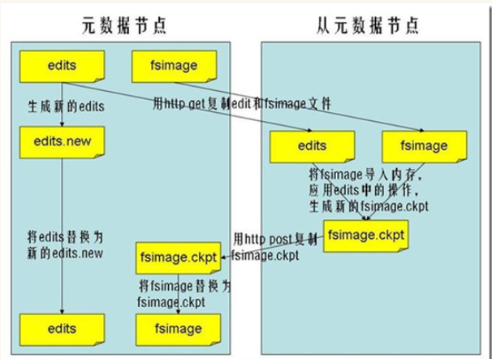

## HDFS

> HDFS（Hadoop Distributed File System）

### HDFS的优点

- 兼容廉价的硬件设备

- 流数据读写

  批量读取而非随机读

- 大数据集

  文件达到GB或TB大小

- 简单的文件模型

  一次写入，无法修改，多次读取

- 跨平台兼容性

  java实现的

### HDFS的缺点

- 不适合低延迟数据访问
- 无法高效存储大量小文件

### HDFS相关概念

- 块

  一般操作系统的文件系统块有几千字节，文件系统块中的磁盘块为512字节

  HDFS的块大小为128MB（Hadoop2.X）

- NameNode

  负责管理分布式文件系统的命名空间，。

  其中有两个核心的数据结构EditLog和FsImage：

  - FsImage负责维护文件系统树以及文件树中的所有文件和文件夹的元数据，FsImage不会持久化这些信息，会在启动时扫描所有的数据节点得到这些信息
  - EditLog中记录所有针对文件的创建、删除、重命名等操作

- SecondNameNode

  由于EditLog的不断增大，需要不断的将EditLog中的内容与FsImage合并

  好处：

  - 当NameNode出现故障，SecondNameNode会保存部分信息
  - 不断的更新FsImage，避免EditLog过大

- DataNode

  负责数据的存储和读取，并定期向名称节点发送自己所存储块的列表

### HDFS的局限性

- 命名空间的限制

  因为NameNode是在内存中保存的，所以命名空间的大小受到内存的限制

- 性能的瓶颈

  整个分布式文件系统的吞吐量，受限于NameNode的吞吐量

- 隔离问题

  整体系统中只有一个NameNode，一个命名空间，对不同应用无法隔离

- 集群的可用性

  如果NameNode不可用，整个集群就不可用